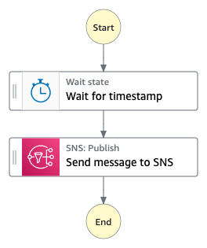

# The “Request response” pattern

When Step Functions calls another service using the Task state, the default pattern is Request Response . With this task orchestration pattern, Step Functions will call the service and then immediately proceed to the next state. The Task state will not wait for the underlying job to complete.

In this module you will run a Task using the Request Response pattern.

When you specify a service in the "Resource" string of your task state, and you only provide the resource, Step Functions will wait for an HTTP response from the service API and then will immediately progress to the next state. Step Functions will not wait for a job to complete. This called the Request Response pattern.

In this sample app we will wait for a specified delay, then we will publish to a SNS topic using the Request Response pattern.

##Testing  
"Start execution" on this state machine using the following input values:

```
{ "message": "Welcome to re:Invent!", "timer_seconds": 5 }
```

